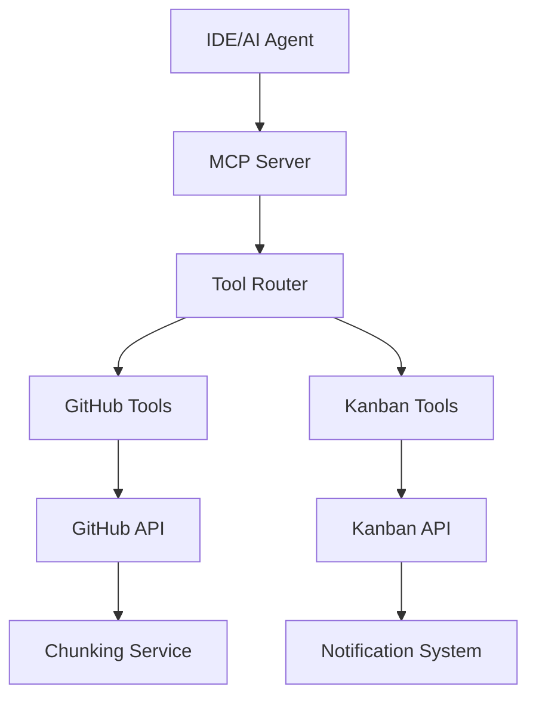

# Kanban GitHub MCP Server

A comprehensive Model Context Protocol (MCP) server that integrates GitHub functionality with Kanban board management, enabling AI agents in IDEs like Cursor and VS Code to seamlessly manage pull requests, issues, and Kanban tasks.

## 🎯 Features

### GitHub Integration
- **Pull Request Management**: Read, create, analyze, and review PRs
- **Issue Management**: Create, update, and manage GitHub issues
- **Code Review**: Add comments, submit reviews, and manage review workflows
- **Intelligent Analysis**: AI-powered PR analysis for code quality and complexity assessment
- **Smart Pagination**: Handle large files and repositories with intelligent chunking

### Kanban Board Integration
- **Task Management**: Link GitHub PRs/issues to Kanban tasks automatically
- **Status Synchronization**: Automatically sync PR status changes to task status
- **Workflow Automation**: Create tasks from PRs/issues with intelligent categorization
- **Advanced Analytics**: Integrate GitHub metrics with Kanban metrics

### Advanced Features
- **Chunked File Reading**: Handle large files with token-aware pagination
- **Rate Limiting**: Intelligent GitHub API rate limit management
- **Error Handling**: Comprehensive error handling with retry mechanisms
- **Real-time Notifications**: Integration with Kanban notification system

## 🚀 Quick Start

### Prerequisites
- Node.js 18+ installed
- GitHub Personal Access Token with `repo` scope
- Running Kanban board backend (optional)

### Installation

1. **Clone and install dependencies**:
```bash
cd /mnt/c/Users/vedan/Desktop/mcp-rag/kanban/mcp-server
npm install
```

2. **Configure environment variables**:
```bash
cp .env.example .env
# Edit .env with your configuration
```

Required environment variables:
```bash
GITHUB_TOKEN=ghp_your_github_token_here
KANBAN_API_URL=http://localhost:3000/api  # Optional
KANBAN_API_TOKEN=your_kanban_jwt_token    # Optional
```

3. **Build and run**:
```bash
npm run build
npm start

# Or for development:
npm run dev
```

## 🛠 Available Tools

### GitHub Tools

#### `read_pr`
Read detailed information about a GitHub pull request.
```typescript
{
  owner: string;
  repo: string;
  pullNumber: number;
}
```

#### `list_pr_files`
List all files changed in a pull request with pagination.
```typescript
{
  owner: string;
  repo: string;
  pullNumber: number;
  page?: number;
  perPage?: number;
}
```

#### `read_file_diff`
Read the diff for a specific file in a pull request.
```typescript
{
  owner: string;
  repo: string;
  pullNumber: number;
  filename: string;
  maxLines?: number;
}
```

#### `read_file_chunked`
Read large file diffs with intelligent chunking and pagination.
```typescript
{
  owner: string;
  repo: string;
  pullNumber: number;
  filename: string;
  chunkIndex?: number;
  maxTokens?: number;
  contextToken?: string;
}
```

#### `create_pr`
Create a new pull request.
```typescript
{
  owner: string;
  repo: string;
  title: string;
  head: string;
  base: string;
  body?: string;
  draft?: boolean;
}
```

#### `add_pr_comment`
Add a review comment to a specific line in a pull request.
```typescript
{
  owner: string;
  repo: string;
  pullNumber: number;
  path: string;
  line: number;
  body: string;
  side?: 'LEFT' | 'RIGHT';
}
```

#### `submit_review`
Submit a complete review for a pull request.
```typescript
{
  owner: string;
  repo: string;
  pullNumber: number;
  event: 'APPROVE' | 'REQUEST_CHANGES' | 'COMMENT';
  body: string;
  comments?: Array<{
    path: string;
    line: number;
    body: string;
  }>;
}
```

#### `analyze_pr`
Analyze a pull request for code quality, complexity, and potential issues.
```typescript
{
  owner: string;
  repo: string;
  pullNumber: number;
  analyzeFiles?: boolean;
  maxFiles?: number;
}
```

#### `create_issue`
Create a new GitHub issue.
```typescript
{
  owner: string;
  repo: string;
  title: string;
  body?: string;
  assignees?: string[];
  labels?: string[];
  milestone?: number;
}
```

#### `update_issue`
Update an existing GitHub issue.
```typescript
{
  owner: string;
  repo: string;
  issueNumber: number;
  title?: string;
  body?: string;
  state?: 'open' | 'closed';
  assignees?: string[];
  labels?: string[];
}
```

### Kanban Integration Tools

#### `link_task_to_pr`
Link a Kanban task to a GitHub pull request.
```typescript
{
  taskId: string;
  owner: string;
  repo: string;
  pullNumber: number;
  autoSync?: boolean;
}
```

#### `sync_pr_status`
Sync GitHub pull request status changes to linked Kanban tasks.
```typescript
{
  taskId: string;
  prStatus: 'open' | 'closed' | 'merged';
  owner?: string;
  repo?: string;
  pullNumber?: number;
}
```

#### `create_task_from_pr`
Create a new Kanban task from a GitHub pull request.
```typescript
{
  owner: string;
  repo: string;
  pullNumber: number;
  boardId: string;
  columnId?: string;
  swimlaneId?: string;
  assigneeId?: string;
  priority?: 'CRITICAL' | 'HIGH' | 'MEDIUM' | 'LOW';
  estimateFromChanges?: boolean;
}
```

#### `create_task_from_issue`
Create a new Kanban task from a GitHub issue.
```typescript
{
  owner: string;
  repo: string;
  issueNumber: number;
  boardId: string;
  columnId?: string;
  swimlaneId?: string;
  assigneeId?: string;
  priority?: 'CRITICAL' | 'HIGH' | 'MEDIUM' | 'LOW';
}
```

## 📊 Usage Examples

### Reading a Large Pull Request
```typescript
// Get PR overview
const pr = await mcp.call('read_pr', {
  owner: 'facebook',
  repo: 'react',
  pullNumber: 12345
});

// List changed files
const files = await mcp.call('list_pr_files', {
  owner: 'facebook',
  repo: 'react',
  pullNumber: 12345
});

// Read large file with chunking
const firstChunk = await mcp.call('read_file_chunked', {
  owner: 'facebook',
  repo: 'react',
  pullNumber: 12345,
  filename: 'packages/react/src/React.js'
});

// Continue to next chunk
const nextChunk = await mcp.call('read_file_chunked', {
  contextToken: firstChunk._meta.pagination.contextToken,
  chunkIndex: 1
});
```

### Performing Code Review
```typescript
// Analyze PR for issues
const analysis = await mcp.call('analyze_pr', {
  owner: 'facebook',
  repo: 'react',
  pullNumber: 12345,
  analyzeFiles: true
});

// Add inline comment
await mcp.call('add_pr_comment', {
  owner: 'facebook',
  repo: 'react',
  pullNumber: 12345,
  path: 'src/React.js',
  line: 42,
  body: 'Consider using useMemo here for better performance'
});

// Submit review
await mcp.call('submit_review', {
  owner: 'facebook',
  repo: 'react',
  pullNumber: 12345,
  event: 'REQUEST_CHANGES',
  body: 'Good work overall, but please address the performance concerns.',
  comments: [{
    path: 'src/React.js',
    line: 42,
    body: 'This computation could be expensive in large components'
  }]
});
```

### Kanban Integration
```typescript
// Create task from PR
const task = await mcp.call('create_task_from_pr', {
  owner: 'facebook',
  repo: 'react',
  pullNumber: 12345,
  boardId: 'board-123',
  priority: 'HIGH',
  estimateFromChanges: true
});

// Link existing task to PR
await mcp.call('link_task_to_pr', {
  taskId: 'task-456',
  owner: 'facebook',
  repo: 'react',
  pullNumber: 12345,
  autoSync: true
});

// Sync PR status when it gets merged
await mcp.call('sync_pr_status', {
  taskId: 'task-456',
  prStatus: 'merged'
});
```

## 🔧 Configuration

### Environment Variables

| Variable | Description | Required | Default |
|----------|-------------|----------|---------|
| `GITHUB_TOKEN` | GitHub personal access token | ✅ | - |
| `KANBAN_API_URL` | Kanban backend API URL | ❌ | `http://localhost:3000/api` |
| `KANBAN_API_TOKEN` | Kanban API authentication token | ❌ | - |
| `LOG_LEVEL` | Logging level (debug, info, warn, error) | ❌ | `info` |
| `MAX_TOKENS_PER_CHUNK` | Maximum tokens per chunk | ❌ | `4000` |
| `CONTEXT_TTL_MINUTES` | Pagination context TTL | ❌ | `30` |

### GitHub Token Permissions

Your GitHub token needs the following scopes:
- `repo` - Full repository access (for private repos)
- `public_repo` - Public repository access (for public repos only)
- `read:user` - Read user profile data

## 🏗 Architecture

### Core Components

1. **MCP Server (`src/server.ts`)**
   - Central server managing tool registration and request handling
   - Handles authentication and client initialization

2. **GitHub Client (`src/clients/github-client.ts`)**
   - Wrapper around Octokit with rate limiting and error handling
   - Implements retry logic and authentication management

3. **Kanban Client (`src/clients/kanban-client.ts`)**
   - HTTP client for Kanban board API integration
   - Handles task management and board operations

4. **Chunking Service (`src/utils/chunking.ts`)**
   - Intelligent file chunking with token estimation
   - Pagination context management with encryption

5. **Tools (`src/tools/`)**
   - Individual MCP tools for specific operations
   - Organized by functionality (GitHub, Kanban integration)

### Data Flow



## 🔍 Debugging

### Enable Debug Logging
```bash
LOG_LEVEL=debug npm start
```

### Common Issues

1. **GitHub Rate Limiting**
   - The server automatically handles rate limits with exponential backoff
   - Check your token's rate limit status in logs

2. **Large File Handling**
   - Use `read_file_chunked` instead of `read_file_diff` for files > 4000 tokens
   - Adjust `MAX_TOKENS_PER_CHUNK` for smaller chunks if needed

3. **Kanban Integration**
   - Ensure your Kanban backend is running and accessible
   - Verify `KANBAN_API_TOKEN` is valid and has sufficient permissions

## 🧪 Testing

```bash
# Run type checking
npm run type-check

# Run linting
npm run lint

# Build project
npm run build
```

## 🤝 Contributing

1. Fork the repository
2. Create your feature branch (`git checkout -b feature/amazing-feature`)
3. Commit your changes (`git commit -m 'Add some amazing feature'`)
4. Push to the branch (`git push origin feature/amazing-feature`)
5. Open a Pull Request

## 📝 License

MIT License - see [LICENSE](LICENSE) for details.

## 🆘 Support

- **GitHub Issues**: [Report bugs and request features](https://github.com/your-org/kanban-github-mcp-server/issues)
- **Documentation**: Check the inline code documentation for detailed API information
- **Examples**: See the `examples/` directory for usage examples

---

Made with ❤️ for the Model Context Protocol ecosystem